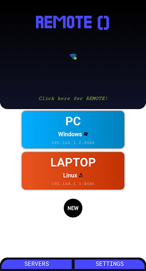

# **Remote Controller**

<div align="center">

Control sound on your computer (+ other features).    

</div>

---
<div align="center">





</div>

---
<div align="center">  

## **FEATURES:**

FEATURE | WINDOWS | LINUX
--- | --- | ---
Mute/Unmute | Y | N
SetVolume | Y | N
PlusVolume | Y | N
MinusVolume | Y | N
Lock | Y | Y
ShutDown | N | N
 
</div>

---

### **SETUP: (WINDOWS)**
1. Clone repository -> git clone ...
2. Change directory -> cd remote
3. Create virtualenv (or skip) and install requirements.txt ->
```
pip3 install -r requirements.py
```
4. Run remote-server script ->
```
python3 remote-server.py
```
you can also set server password (default: pass)->
```
python3 remote-server.py mypassword
```
5. Change directory to remote (React app) -> cd remote
6. Install dependencies and start development server ->
```
npm install
```
then ->
```
npm start
```
7. visit *{server_ip}:8080* on your phone.
8. Save app to Home.
9. Click on "SERVERS" button and create new server profile
10. Click on server profile and wait.
